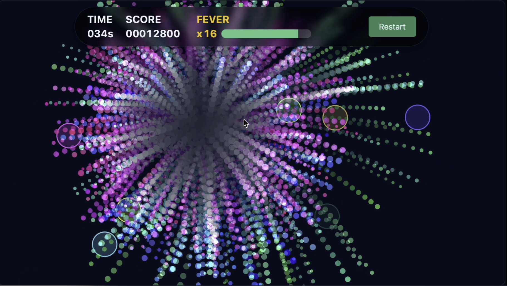

# Hanabee 🎆

ブラウザで遊べる花火の連鎖ゲームです。  
クリックで花火を爆発させ、連鎖をつなげてスコアを競います。  
JavaScript (Canvas API) を中心に制作し、ビジュアルや動きはすべて JS 側で描画しています。CSS はレイアウトや文字装飾など補助的に利用しています。

👉 [こちらから遊べます](https://samoyed130-zen.github.io/Hanabee/)
👉 [GASのリーダーボードはこちら](./gas)

---

## ゲーム概要
- 制限時間内にできるだけ高いスコアを目指します。
- 花火を爆発させると周囲の花火も誘爆し、連鎖数に応じてスコアが増加します。
- コンボが最大状態を一定時間維持すると **フィーバータイム** が発動し、花火の発生頻度と速度が上昇します。

---

## 操作方法
- **クリック / タップ** : 画面上の花火を爆発させる

---

## HUD画面サンプル

---

## 開発環境
- HTML / CSS (Tailwind CSS)
- JavaScript
- GitHub Pages で公開

---

## ランキング機能
- リザルトのリーダーボードはGoogle Apps Scriptと連携させることで、オンラインランキングにも対応しています。
